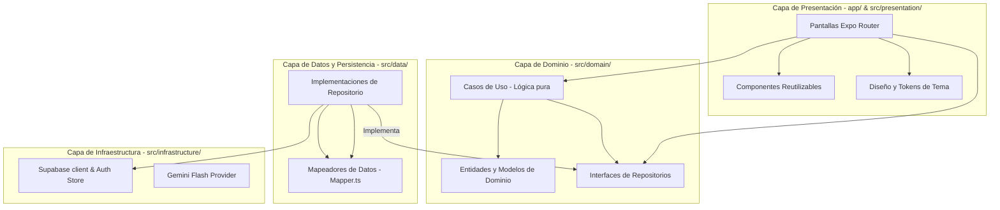
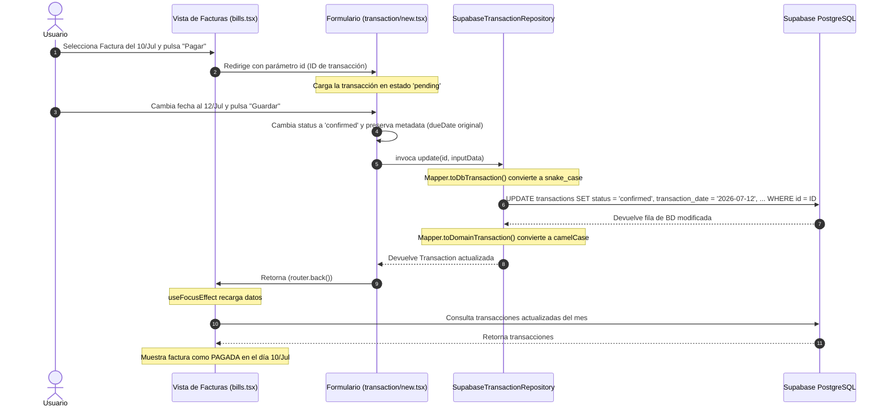

# ARCHITECTURE.md — ZenMoney: Plano de Ingeniería

Este documento describe la arquitectura lógica, el flujo de datos, el stack tecnológico y los patrones de diseño aplicados en ZenMoney.

---

## 1. Stack Tecnológico
El sistema está construido bajo la combinación de las siguientes tecnologías:

- **Frontend / Cliente**:
  - **Core**: React Native + Expo (SDK 57, TypeScript en modo estricto).
  - **Enrutamiento**: Expo Router (File-based routing, Typed Routes habilitados).
  - **Diseño Visual**: React Native Paper (MD3 design system) + Custom HSL/Hex theme tokens (soporte automático para Modo Oscuro).
  - **Animaciones**: Animated API de RN (con miras a migrar a Reanimated).
  - **Estado Global**: Zustand (Gestión ligera y reactiva del estado de autenticación).
- **Backend / Persistencia / Infraestructura**:
  - **Base de Datos**: PostgreSQL alojado en Supabase Cloud.
  - **Seguridad**: Row-Level Security (RLS) policies + JWT de Supabase Auth.
  - **IA & NLQ**: Gemini API (modelo Gemini 1.5 Flash) consumido mediante cliente REST directo para parseo de lenguaje natural.

---

## 2. Arquitectura de Software: Clean Architecture
ZenMoney implementa una variante simplificada de Clean Architecture para separar las reglas de negocio de los detalles de infraestructura:

### Capas del Directorio `src/`
1. **`domain/` (Dominio)**: Contiene las entidades puras de TypeScript (ej: `Transaction`, `Account`, `Budget`) y los casos de uso (`CalculateAccountBalance`, `GenerateRecurringInstances`, etc.). No depende de nada externo.
2. **`data/` (Datos)**: Implementa las interfaces de repositorios del dominio conectándolas con Supabase. Contiene `Mapper.ts`, responsable de la transformación bidireccional entre las filas de BD (`snake_case`) y las entidades (`camelCase`).
3. **`infrastructure/` (Infraestructura)**: Gestión del cliente de Supabase, el almacén de autenticación global (`useAuthStore`) y el proveedor de IA.
4. **`presentation/` (Presentación)**: Componentes reactivos, hooks personalizados de temas (`useAppTheme`) y utilidades visuales de MD3.

---

## 3. Flujo de Datos (Data Flow)
El siguiente diagrama detalla cómo viaja la información al ejecutar una acción común de negocio: **Pagar una Factura Agendada**.

---

## 4. Gestión de Estado Global vs. Local
- **Estado Global (`Zustand`)**:
  - Exclusivo para el perfil del usuario autenticado, el token de sesión y el grupo familiar activo (`useAuthStore`).
  - Permite a la app validar el flujo de guards al inicio (`app/_layout.tsx`) y denegar accesos en tiempo real.
- **Estado Local (`React.useState`)**:
  - Las pantallas cargan su propio estado al recibir el foco usando `useFocusEffect`.
  - No existe un caché de datos contables centralizado en memoria (ej: Redux o React Query); cada pantalla interactúa directamente con los repositorios para garantizar que los saldos y listados reflejen inmediatamente los cambios de la base de datos sin latencia de sincronización.
