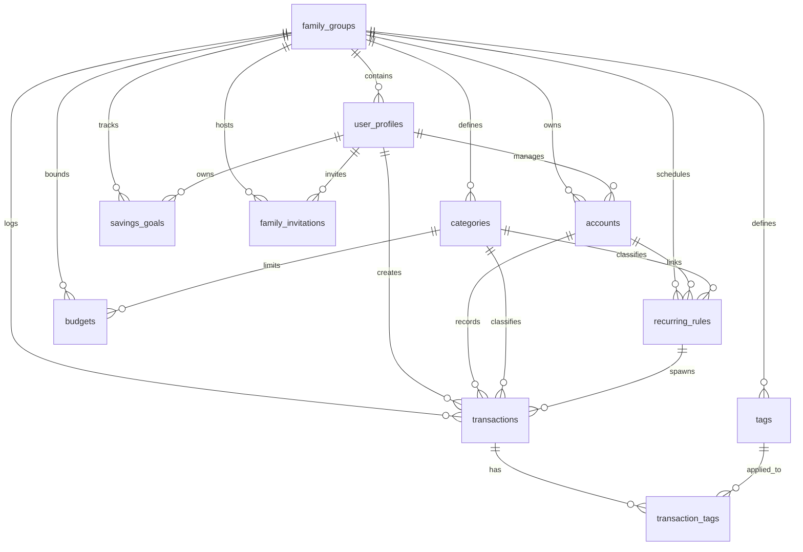

# DATA_MODEL.md — ZenMoney: Contrato de Persistencia

Este documento detalla el esquema físico de la base de datos relacional de Supabase (PostgreSQL), los índices de optimización, las restricciones de integridad, las políticas de seguridad a nivel de fila (RLS) y la lógica de traducción de datos (Mapping).

---

## 1. Esquema Relacional de Base de Datos
El esquema está compuesto por 11 tablas creadas de forma estructurada para evitar dependencias circulares:



---

## 2. Definición Detallada de Tablas

### 1. `family_groups`
- **Propósito**: Unidad de multitenancy. Representa una familia.
- **Campos**:
  - `id`: `uuid PRIMARY KEY DEFAULT gen_random_uuid()`
  - `name`: `text NOT NULL`
  - `currency_default`: `text NOT NULL DEFAULT 'COP'`
  - `created_at`: `timestamptz DEFAULT now()`

### 2. `user_profiles`
- **Propósito**: Perfil de usuario del dominio, vinculado a Supabase Auth (`auth.users`).
- **Campos**:
  - `id`: `uuid PRIMARY KEY DEFAULT gen_random_uuid()`
  - `auth_user_id`: `uuid NOT NULL REFERENCES auth.users(id) ON DELETE CASCADE`
  - `family_group_id`: `uuid NOT NULL REFERENCES family_groups(id) ON DELETE CASCADE`
  - `display_name`: `text NOT NULL`
  - `email`: `text NOT NULL`
  - `role`: `text NOT NULL DEFAULT 'editor'` (**CHECK**: `'admin'`, `'editor'`, `'viewer'`)
  - `created_at`: `timestamptz DEFAULT now()`
- **Restricciones**:
  - `uq_user_profiles_auth_user_id`: `UNIQUE (auth_user_id)`

### 3. `accounts`
- **Propósito**: Cuentas bancarias, efectivo, deudas a corto y largo plazo.
- **Campos**:
  - `id`: `uuid PRIMARY KEY DEFAULT gen_random_uuid()`
  - `family_group_id`: `uuid NOT NULL REFERENCES family_groups(id) ON DELETE CASCADE`
  - `owner_user_id`: `uuid NOT NULL REFERENCES user_profiles(id)`
  - `name`: `text NOT NULL`
  - `type`: `text NOT NULL` (**CHECK**: `'cash'`, `'bank'`, `'credit_card'`, `'investment'`, `'loan'`, `'mortgage'`)
  - `initial_balance`: `numeric(15,2) NOT NULL DEFAULT 0`
  - `currency`: `text NOT NULL DEFAULT 'COP'`
  - `is_active`: `boolean DEFAULT true`
  - `created_at`: `timestamptz DEFAULT now()`

### 4. `categories`
- **Propósito**: Jerarquía de clasificaciones de transacciones.
- **Campos**:
  - `id`: `uuid PRIMARY KEY DEFAULT gen_random_uuid()`
  - `family_group_id`: `uuid REFERENCES family_groups(id) ON DELETE CASCADE` (Null si es una categoría del sistema/global)
  - `name`: `text NOT NULL`
  - `icon`: `text NOT NULL DEFAULT 'tag'`
  - `color`: `text NOT NULL DEFAULT '#808080'`
  - `parent_category_id`: `uuid REFERENCES categories(id) ON DELETE SET NULL` (Autoreferencia de 2 niveles)
  - `is_system`: `boolean DEFAULT false`
  - `is_private`: `boolean DEFAULT false`
  - `created_at`: `timestamptz DEFAULT now()`

### 5. `recurring_rules`
- **Propósito**: Plantillas para la generación periódica automática de movimientos.
- **Campos**:
  - `id`: `uuid PRIMARY KEY DEFAULT gen_random_uuid()`
  - `family_group_id`: `uuid NOT NULL REFERENCES family_groups(id) ON DELETE CASCADE`
  - `account_id`: `uuid NOT NULL REFERENCES accounts(id) ON DELETE CASCADE`
  - `category_id`: `uuid REFERENCES categories(id) ON DELETE SET NULL`
  - `type`: `text NOT NULL` (**CHECK**: `'income'`, `'expense'`)
  - `amount`: `numeric(15,2) NOT NULL` (**CHECK** `amount > 0`)
  - `description`: `text`
  - `frequency`: `text NOT NULL` (**CHECK**: `'daily'`, `'weekly'`, `'biweekly'`, `'monthly'`, `'yearly'`)
  - `day_of_month`: `integer` (**CHECK**: entre 1 y 31)
  - `start_date`: `date NOT NULL`
  - `end_date`: `date`
  - `is_active`: `boolean DEFAULT true`
  - `created_at`: `timestamptz DEFAULT now()`

### 6. `transactions`
- **Propósito**: El libro mayor unificado de movimientos contables.
- **Campos**:
  - `id`: `uuid PRIMARY KEY DEFAULT gen_random_uuid()`
  - `family_group_id`: `uuid NOT NULL REFERENCES family_groups(id) ON DELETE CASCADE`
  - `account_id`: `uuid NOT NULL REFERENCES accounts(id) ON DELETE CASCADE`
  - `category_id`: `uuid REFERENCES categories(id) ON DELETE SET NULL`
  - `created_by_user_id`: `uuid NOT NULL REFERENCES user_profiles(id)`
  - `type`: `text NOT NULL` (**CHECK**: `'income'`, `'expense'`, `'transfer'`)
  - `amount`: `numeric(15,2) NOT NULL` (**CHECK** `amount > 0`)
  - `currency`: `text NOT NULL DEFAULT 'COP'`
  - `description`: `text`
  - `merchant_name`: `text`
  - `transaction_date`: `date NOT NULL DEFAULT CURRENT_DATE`
  - `transfer_to_account_id`: `uuid REFERENCES accounts(id)`
  - `is_recurring_instance`: `boolean DEFAULT false`
  - `recurring_rule_id`: `uuid REFERENCES recurring_rules(id) ON DELETE SET NULL`
  - `status`: `text NOT NULL DEFAULT 'confirmed'` (**CHECK**: `'confirmed'`, `'pending'`)
  - `input_method`: `text NOT NULL DEFAULT 'manual'` (**CHECK**: `'manual'`, `'voice'`, `'nlq'`)
  - `ai_metadata`: `jsonb` (Almacena datos del parseador de lenguaje natural e inteligencia artificial)
  - `created_at`: `timestamptz DEFAULT now()`
  - `updated_at`: `timestamptz DEFAULT now()`
  - `synced_at`: `timestamptz`

### 7. `budgets`
- **Propósito**: Metas de consumo de presupuestos mensuales.
- **Campos**:
  - `id`: `uuid PRIMARY KEY DEFAULT gen_random_uuid()`
  - `family_group_id`: `uuid NOT NULL REFERENCES family_groups(id) ON DELETE CASCADE`
  - `category_id`: `uuid NOT NULL REFERENCES categories(id) ON DELETE CASCADE`
  - `amount_limit`: `numeric(15,2) NOT NULL` (**CHECK** `amount_limit > 0`)
  - `year`: `integer NOT NULL`
  - `month`: `integer NOT NULL` (**CHECK**: entre 1 y 12)
  - `scope`: `text NOT NULL DEFAULT 'family'` (**CHECK**: `'family'`, `'individual'`)
  - `owner_user_id`: `uuid REFERENCES user_profiles(id)`
  - `created_at`: `timestamptz DEFAULT now()`
- **Restricciones de Unicidad**:
  - `uq_idx_budgets_unique_limit`: Evita duplicar un presupuesto para la misma categoría, año, mes, ámbito y usuario propietario:
    `UNIQUE (family_group_id, category_id, year, month, scope, COALESCE(owner_user_id, '00000000-0000-0000-0000-000000000000'::uuid))`

### 8. `savings_goals`
- **Propósito**: Metas de ahorro con fechas objetivo.
- **Campos**:
  - `id`: `uuid PRIMARY KEY DEFAULT gen_random_uuid()`
  - `family_group_id`: `uuid NOT NULL REFERENCES family_groups(id) ON DELETE CASCADE`
  - `owner_user_id`: `uuid NOT NULL REFERENCES user_profiles(id)`
  - `name`: `text NOT NULL`
  - `target_amount`: `numeric(15,2) NOT NULL` (**CHECK** `target_amount > 0`)
  - `current_amount`: `numeric(15,2) NOT NULL DEFAULT 0` (**CHECK** `current_amount >= 0`)
  - `target_date`: `date NOT NULL`
  - `status`: `text NOT NULL DEFAULT 'active'` (**CHECK**: `'active'`, `'completed'`, `'cancelled'`)
  - `created_at`: `timestamptz DEFAULT now()`

### 9. `auto_categorization_rules`
- **Propósito**: Mapeador automático de categorías a partir de descripciones.
- **Campos**:
  - `id`: `uuid PRIMARY KEY DEFAULT gen_random_uuid()`
  - `family_group_id`: `uuid NOT NULL REFERENCES family_groups(id) ON DELETE CASCADE`
  - `match_pattern`: `text NOT NULL`
  - `category_id`: `uuid NOT NULL REFERENCES categories(id) ON DELETE CASCADE`
  - `priority`: `integer NOT NULL DEFAULT 0`
  - `is_ai_generated`: `boolean DEFAULT false`
  - `created_at`: `timestamptz DEFAULT now()`

### 10. `notification_preferences`
- **Propósito**: Preferencias por usuario y tipo de alerta.
- **Campos**:
  - `id`: `uuid PRIMARY KEY DEFAULT gen_random_uuid()`
  - `user_id`: `uuid NOT NULL REFERENCES user_profiles(id) ON DELETE CASCADE`
  - `type`: `text NOT NULL` (**CHECK**: `'budget_80'`, `'budget_100'`, `'unusual_expense'`, `'low_balance'`, `'payment_due'`)
  - `enabled`: `boolean DEFAULT true`
  - `config`: `jsonb DEFAULT '{}'`
  - `created_at`: `timestamptz DEFAULT now()`
- **Restricciones**:
  - `uq_notification_preferences_user_type`: `UNIQUE (user_id, type)`

### 11. `family_invitations`
- **Propósito**: Invitaciones enviadas por correo electrónico para integrar un grupo familiar.
- **Campos**:
  - `id`: `uuid DEFAULT gen_random_uuid() PRIMARY KEY`
  - `family_group_id`: `uuid NOT NULL REFERENCES family_groups(id) ON DELETE CASCADE`
  - `invited_email`: `text NOT NULL`
  - `role`: `text NOT NULL DEFAULT 'editor'` (**CHECK**: `'admin'`, `'editor'`, `'viewer'`)
  - `status`: `text NOT NULL DEFAULT 'pending'` (**CHECK**: `'pending'`, `'accepted'`, `'rejected'`)
  - `invited_by_user_id`: `uuid NOT NULL REFERENCES user_profiles(id) ON DELETE CASCADE`
  - `created_at`: `timestamptz DEFAULT now()`
- **Restricciones**:
  - `UNIQUE (family_group_id, invited_email, status)`

### 12. `tags`
- **Propósito**: Etiquetas personalizables para agrupar o marcar gastos temporalmente (ej. 'Sin conciliar').
- **Campos**:
  - `id`: `uuid DEFAULT gen_random_uuid() PRIMARY KEY`
  - `family_group_id`: `uuid NOT NULL REFERENCES family_groups(id) ON DELETE CASCADE`
  - `name`: `text NOT NULL`
  - `color`: `text NOT NULL DEFAULT '#808080'`
  - `created_at`: `timestamptz DEFAULT now()`
- **Restricciones**:
  - `UNIQUE (family_group_id, name)`

### 13. `transaction_tags`
- **Propósito**: Tabla de relación muchos a muchos entre transacciones y etiquetas.
- **Campos**:
  - `transaction_id`: `uuid NOT NULL REFERENCES transactions(id) ON DELETE CASCADE`
  - `tag_id`: `uuid NOT NULL REFERENCES tags(id) ON DELETE CASCADE`
  - `created_at`: `timestamptz DEFAULT now()`
- **Restricciones**:
  - `PRIMARY KEY (transaction_id, tag_id)`

---

## 3. Índices de Base de Datos
Creados para acelerar consultas comunes de visualización y filtrado:

- `idx_transactions_family_date`: `transactions(family_group_id, transaction_date DESC)` -> Crítico para renderizar la lista de movimientos recientes rápidamente.
- `idx_transactions_family_account`: `transactions(family_group_id, account_id)` -> Acelera el cálculo del saldo consolidado de cuentas individuales.
- `idx_transactions_family_category`: `transactions(family_group_id, category_id)` -> Acelera la suma del consumo de presupuestos.
- `idx_transactions_family_user`: `transactions(family_group_id, created_by_user_id)` -> Optimiza auditorías por usuario.
- `idx_accounts_family`: `accounts(family_group_id)` -> Listado rápido del balance del Dashboard.
- `idx_categories_family`: `categories(family_group_id)` -> Carga rápida de la estructura categórica.
- `idx_budgets_family_period`: `budgets(family_group_id, year, month)` -> Carga mensual del indicador de consumo de presupuestos.
- `idx_user_profiles_family`: `user_profiles(family_group_id)` -> Consulta rápida de miembros de la familia.
- `idx_user_profiles_auth_user`: `user_profiles(auth_user_id)` -> Búsqueda inmediata al validar el inicio de sesión.
- `idx_auto_cat_rules_family_priority`: `auto_categorization_rules(family_group_id, priority)` -> Agiliza el orden de precedencia de categorización automática.

---

## 4. Políticas de Row-Level Security (RLS) & Auditoría Multi-Tenant

La base de datos cuenta con **RLS habilitado en el 100% de las tablas** y reforzado mediante la migración [`00011_rls_audit_and_hardening.sql`](file:///d:/Documentos/Iniciativas/FinanzasPersonales/zenmoney/supabase/migrations/00011_rls_audit_and_hardening.sql). Se apoya en tres funciones seguras (`SECURITY DEFINER`):
- `public.get_user_profile_id()`: Retorna el `id` del perfil de usuario del usuario autenticado.
- `public.get_user_family_group_id()`: Retorna el `family_group_id` del usuario autenticado leyendo su perfil.
- `public.get_user_role()`: Retorna el rol del usuario autenticado (`admin`, `editor`, `viewer`).

### Resumen de Matriz de Auditoría de Políticas de Acceso

| Tabla | Operación | Regla de Acceso (Políticas RLS Reforzadas) |
|---|---|---|
| `family_groups` | `SELECT` | `id = get_user_family_group_id()` |
| | `INSERT` | Cualquier usuario autenticado (durante el registro) |
| | `UPDATE` | Miembro con rol `'admin'` únicamente |
| `user_profiles` | `SELECT` | `family_group_id = get_user_family_group_id()` |
| | `INSERT` | Si el `auth_user_id` coincide con el suyo o administrador del grupo familiar |
| | `UPDATE` | Miembros con rol `'admin'` |
| `accounts` | `SELECT` | `family_group_id = get_user_family_group_id() AND (is_private = false OR created_by_user_id = get_user_profile_id())` |
| | `INSERT/UPD/DEL`| `family_group_id = get_user_family_group_id() AND get_user_role() IN ('admin', 'editor')` |
| `categories` | `SELECT` | `family_group_id IS NULL OR family_group_id = get_user_family_group_id()` |
| | `INSERT/UPD/DEL`| `family_group_id = get_user_family_group_id() AND get_user_role() IN ('admin', 'editor')` |
| `transactions` | `SELECT` | `family_group_id = get_user_family_group_id() AND (is_private = false OR created_by_user_id = get_user_profile_id())` |
| | `INSERT/UPD/DEL`| `family_group_id = get_user_family_group_id() AND get_user_role() IN ('admin', 'editor')` |
| `recurring_rules`| `ALL` | `family_group_id = get_user_family_group_id() AND get_user_role() IN ('admin', 'editor')` (`SELECT` permitido a `viewer`) |
| `budgets` | `ALL` | `family_group_id = get_user_family_group_id() AND get_user_role() IN ('admin', 'editor')` (`SELECT` permitido a `viewer`) |
| `savings_goals` | `ALL` | `family_group_id = get_user_family_group_id() AND get_user_role() IN ('admin', 'editor')` (`SELECT` permitido a `viewer`) |
| `assistant_messages` | `ALL` | `user_id = get_user_profile_id()` (Aislamiento total por usuario, no compartido con familia) |
| `family_invitations` | `ALL` | `family_group_id = get_user_family_group_id() AND get_user_role() = 'admin'` |
| `audit_logs` | `SELECT` | `family_group_id = get_user_family_group_id()` (Lectura inmutable para el hogar; `INSERT/UPD/DEL` bloqueados públicamente) |

---

## 5. Estructura de Columnas JSONB
- **`transactions.ai_metadata`**:
  ```json
  {
    "raw_input": "String: El texto o transcripción original procesado por la IA",
    "parsed_amount": "Number: El monto detectado (o null)",
    "parsed_category": "String: La categoría inferida (o null)",
    "parsed_account": "String: La cuenta sugerida (o null)",
    "parsed_merchant": "String: El comercio identificado (o null)",
    "confidence": "Number: Coeficiente de certeza entre 0 y 1",
    "corrections": "Object: Registro de modificaciones manuales de corrección del usuario",
    "due_date": "String: Fecha de vencimiento YYYY-MM-DD (para la Agenda de Facturas)"
  }
  ```

---

## 6. Lógica de Mapeo y Traducción (`Mapper.ts`)
El archivo `src/data/models/Mapper.ts` se encarga de convertir de filas PostgreSQL a entidades TypeScript y viceversa:

### Reglas de Mapeo de Nombres de Propiedades
- Traduce automáticamente columnas `snake_case` de la base de datos a variables `camelCase` del dominio. Ejemplos:
  - `family_group_id` ↔ `familyGroupId`
  - `transfer_to_account_id` ↔ `transferToAccountId`
  - `is_recurring_instance` ↔ `isRecurringInstance`
- Casts numéricos estrictos:
  - Las columnas numéricas decimales (`numeric(15,2)`) de Postgres se devuelven como strings en los drivers crudos. El mapeador fuerza su conversión a números nativos usando `Number()` en campos como `initialBalance`, `amount`, `amountLimit` y `targetAmount`.

### ⚠️ RIESGO DE CALIDAD: Omisión de Mapeador en SavingsGoals
El modelo `SavingsGoal` es importado en `Mapper.ts`, pero el archivo **carece de las funciones `toDomainSavingsGoal` y `toDbSavingsGoal`**. Esto causará excepciones fatales e imposibilidad de persistir metas de ahorro si se consume dicha funcionalidad.
