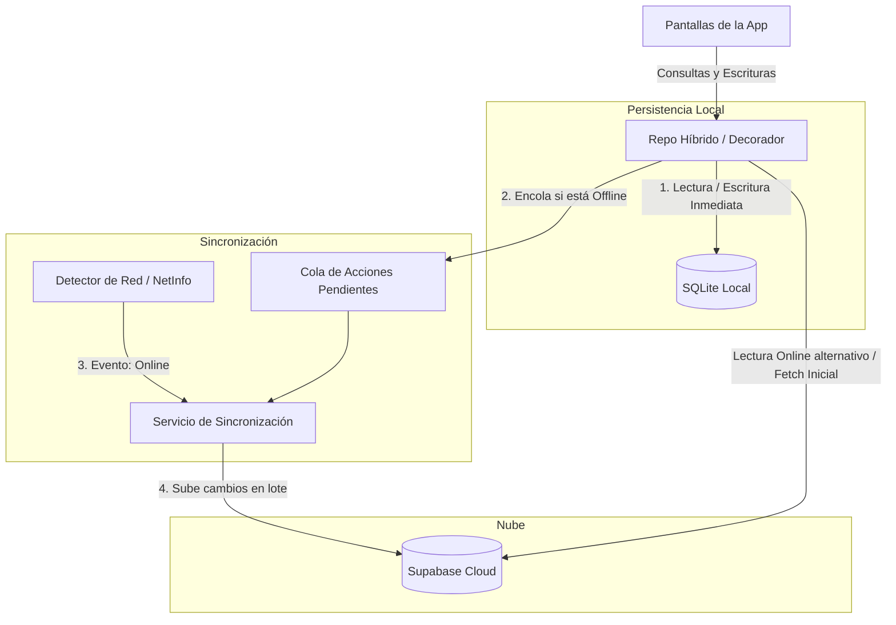

# Plan de Estrategia Offline-First para ZenMoney

Este documento detalla el análisis arquitectónico y la estrategia propuesta para dotar a ZenMoney de capacidades sin conexión (offline), asegurando que la aplicación móvil siga siendo completamente utilizable para consultas y registros financieros aun sin acceso a internet.

---

## 1. Desafío Arquitectónico Actual

Actualmente, ZenMoney depende al 100% de la conectividad en tiempo real:
- Las pantallas (`app/(tabs)/*`) consultan directamente a los repositorios de Supabase en cada foco de pantalla (`useFocusEffect`).
- Si el dispositivo pierde la señal de internet, los llamados de red fallan (`Network Error`), mostrando pantallas vacías, estados de carga infinitos o errores que impiden abrir el formulario de transacciones o facturas.

---

## 2. Estrategia Propuesta: Réplica Local y Cola de Sincronización

Proponemos un enfoque **Offline-First (Offline-First Write-Through Cache)**, donde el dispositivo móvil opera sobre una base de datos local que actúa como una réplica de Supabase, y un servicio en segundo plano se encarga de subir los cambios diferidos cuando se recupera la conexión.



---

## 3. Componentes Clave de la Solución

### A. Motor de Almacenamiento Local: SQLite (`expo-sqlite`)
Para mantener el comportamiento relacional y permitir consultas complejas (filtros por fecha, sumatorias, agrupamientos jerárquicos de categorías y presupuestos), la persistencia clave-valor simple (`AsyncStorage`) no es suficiente.
- **Tecnología:** `expo-sqlite`.
- **Estructura:** Crearemos tablas locales idénticas a las tablas relacionales de Supabase (`transactions`, `accounts`, `categories`, `budgets`), agregando dos columnas de control:
  - `synced`: Booleano (1 = sincronizado con Supabase, 0 = pendiente de subida).
  - `local_updated_at`: Timestamp para control de conflictos.

### B. El Patrón Decorador de Repositorio (Clean Architecture)
Una de las mayores ventajas de haber implementado **Clean Architecture** en ZenMoney es que las pantallas y los Casos de Uso no conocen los detalles de la infraestructura. Solo conocen las interfaces (ej: `TransactionRepository`).

Esto nos permite crear una implementación de repositorio híbrida sin tocar una sola línea de código de las pantallas:

```typescript
export class HybridTransactionRepository implements TransactionRepository {
  constructor(
    private localRepo: SqliteTransactionRepository,
    private remoteRepo: SupabaseTransactionRepository
  ) {}

  async getAll(filters?: TransactionFilters): Promise<Transaction[]> {
    if (await this.isOnline()) {
      try {
        const remoteData = await this.remoteRepo.getAll(filters);
        await this.localRepo.bulkSave(remoteData); // Sincroniza caché local
        return remoteData;
      } catch (err) {
        // Fallback a base local en caso de falla de red silenciosa
        return this.localRepo.getAll(filters);
      }
    } else {
      return this.localRepo.getAll(filters); // Lectura puramente offline
    }
  }

  async create(transaction: CreateTransactionInput): Promise<Transaction> {
    // 1. Guardar localmente de inmediato (UI responde al instante)
    const localTx = await this.localRepo.create({ ...transaction, synced: false });
    
    if (await this.isOnline()) {
      try {
        const remoteTx = await this.remoteRepo.create(transaction);
        await this.localRepo.markAsSynced(localTx.id, remoteTx.id);
      } catch (err) {
        // Queda encolado localmente como synced: false
      }
    }
    return localTx;
  }
}
```

### C. Cola de Sincronización (Sync Queue)
Cuando la aplicación realiza una escritura en modo offline (crear transacción, pagar factura, crear presupuesto):
1. La fila se inserta en la base de datos SQLite local con `synced = false`.
2. Se registra la operación en una tabla de auditoría local (`sync_actions_queue`):
   - `id` (UUID)
   - `action_type` ('INSERT', 'UPDATE', 'DELETE')
   - `table_name` ('transactions', 'budgets', etc.)
   - `payload` (JSON con los datos del registro)
   - `created_at` (Timestamp)

### D. Detector de Estado de Red (`@react-native-community/netinfo`)
Un servicio suscriptor escuchará los cambios de conexión del sistema operativo:
- **Offline -> Online:** Al recuperar internet, activa el `SyncService`.
- El `SyncService` lee la tabla `sync_actions_queue`, procesa las operaciones secuencialmente respetando el orden cronológico para evitar romper la integridad referencial, y actualiza los registros locales a `synced = true`.

---

## 4. Resolución de Conflictos (Reglas de Negocio)

Al ser una aplicación de finanzas personales o familiares, la concurrencia es baja (dos miembros de la familia rara vez modifican la misma transacción exactamente al mismo tiempo). Proponemos las siguientes políticas de resolución:

| Escenario de Conflicto | Estrategia de Resolución | Detalle Técnico |
| :--- | :--- | :--- |
| **Transacción agregada Offline** | Inserción Limpia (Append) | Se sube como un registro nuevo a Supabase. El ID UUID generado localmente evita colisiones. |
| **Misma factura editada en dos móviles** | Última Escritura Gana (LWW) | Supabase evalúa el campo `updated_at`. El registro con el timestamp más reciente sobrescribe al anterior. |
| **Categoría borrada en la nube pero usada Offline** | Fallback a "Sin Clasificar" | Si el móvil intenta subir una transacción asociada a una categoría que el administrador borró en línea, la transacción se reasocia a la categoría por defecto (ID de "Sin Clasificar") en lugar de fallar. |

---

## 5. Plan de Implementación en Fases

Para no comprometer la estabilidad del sistema, la migración a Offline-First se estructurará en 3 etapas incrementales:

### Fase 1: Caché de Lectura (Read Caching)
- Instalar `expo-sqlite`.
- Crear la base de datos local y el esquema inicial en el inicio de la app.
- Implementar el repositorio híbrido solo para lectura: al abrir la app online, descarga y guarda los datos en SQLite; si está offline, lee de SQLite en lugar de fallar.
- **Resultado:** La app abre y muestra saldos, movimientos, presupuestos y facturas en modo avión (Lectura sin conexión).

### Fase 2: Cola de Escrituras Offline (Write Queueing)
- Crear la tabla `sync_actions_queue` en SQLite.
- Habilitar escrituras locales en repositorios cuando la app está sin conexión.
- Los formularios permiten guardar registros offline y actualizan el estado visual inmediatamente.
- **Resultado:** El usuario puede registrar gastos e ingresos en la calle sin señal.

### Fase 3: Sincronización en Segundo Plano y NetInfo
- Integrar `@react-native-community/netinfo`.
- Desarrollar el `SyncService` para procesar la cola de subidas.
- Implementar retroalimentación visual al usuario (un pequeño banner o indicador: *"Sincronizando cambios..."* o *"Modo sin conexión - X cambios pendientes"*).
- **Resultado:** Sincronización bidireccional automática y robusta al recuperar internet.

---

> [!NOTE]
> Este plan arquitectónico aprovecha al máximo la estructura de Clean Architecture actualmente presente en ZenMoney, requiriendo modificaciones nulas en las vistas y pantallas y aislando toda la lógica offline en la capa de datos (`src/data/` e `infrastructure/`).
